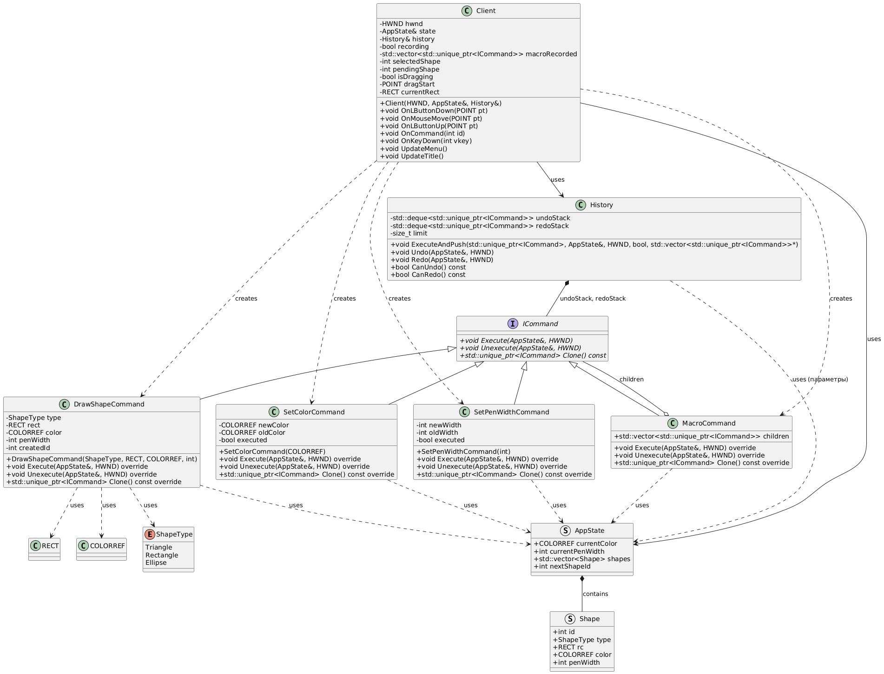
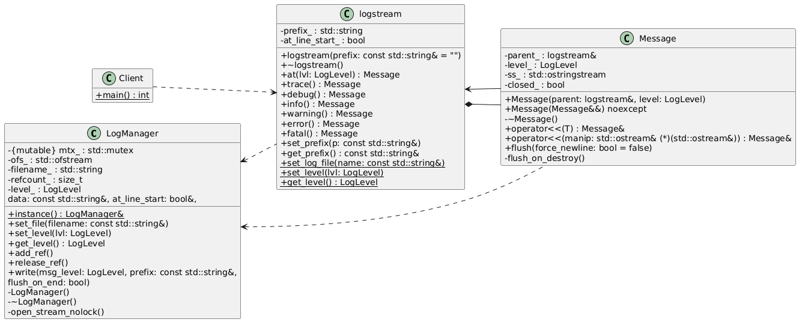
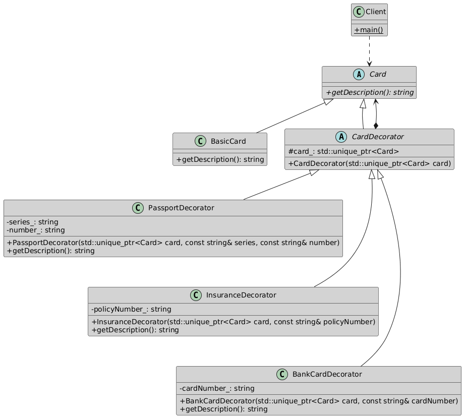
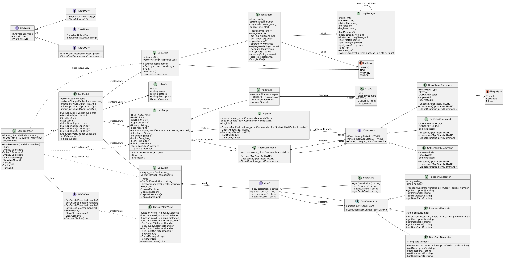

# Репозиторий изучения паттернов проектирования на C++
Данный репозиторий содержит учебные проекты, демонстрирующие применение порождающих, поведенческих, структурных и архитектурных паттернов на языке C++
## Структура репозитория
- Project1-command/ - графический редактор (паттерн Command)
- Project2-singleton/ - потокобезопасный логгер (паттерн Singleton)
- Project3-decorator/ - универсальная электронная карта (паттерн Decorator)
- Project4-MVP/ - главное меню с запуском проектов (паттерн MVP)

В каждой папке проекта находятся две версии:
- without_pattern - реализация без использования паттерна
- with_pattern - реализация с применением соответствующего паттерна
## Project1-command: Графический редактор (паттерн Command)
Приложение для рисования простых фигур (треугольник, прямоугольник, эллипс) с возможностью менять цвет и толщину пера. Поддержка операций Отмена и Повтор, а также запись и воспроизведение макросов (последовательности действий).

**Версия без паттерна (without_pattern):**
- Каждое действие (рисование, изменение цвета и т.д.) обрабатывается непосредственно в обработчиках событий.
- Отмена/повтор реализуются через сохранение полных состояний, что приводит к дублированию кода и трудностям при добавлении новых операций.

**Версия с паттерном (with_pattern):**
- Все операции инкапсулированы в виде команд, реализующих интерфейс ICommand с методами Execute(), Unexecute() и Clone().
- Конкретные команды: DrawShapeCommand, SetColorCommand, SetPenWidthCommand, MacroCommand.
- История команд хранится в классе History 
- При выполнении команды она автоматически помещается в историю; при отмене/повторе вызываются соответствующие методы команд.

**UML диаграмма классов**

## Project2-singleton: Потокобезопасный логгер (паттерн Singleton)
Cистема логирования, доступная из любого места программы, с поддержкой уровней логирования (DEBUG, INFO, WARNING, ERROR) и записью в файл.

**Версия без паттерна (without_pattern):**
- Используется глобальный объект.
- Управление единственностью экземпляра ложится на программиста, легко создать несколько объектов.

**Версия с паттерном (with_pattern):**
- Класс LogManager реализует классический потокобезопасный Singleton
- Для удобного поточного форматирования используется класс logstream, который автоматически добавляет префикс уровня и временную метку.
- Управление файлом и синхронизацией вынесено в синглтон; все потоки пишут через него.

**UML диаграмма классов**

## Project3-decorator: Универсальная электронная карта (паттерн Decorator)
Cтруктуру данных для универсальной электронной карты, которая может динамически дополняться функциями: паспортные данные, страховой полис, банковская карта. Возможность гибко комбинировать эти функции без создания множества наследников.

**Версия без паттерна (without_pattern):**
- Добавление нового компонента требует модификации существующего класса
- Вся функциональность сосредоточена в одном классе UniversalCard.

**Версия с паттерном (with_pattern):**
- Базовый класс Card определяет интерфейс.
- Конкретный компонент BasicCard предоставляет базовую функциональность.
- Абстрактный декоратор CardDecorator хранит ссылку на обёрнутый объект и делегирует вызовы.
- Конкретные декораторы (PassportDecorator, InsuranceDecorator, BankCardDecorator) добавляют соответствующие данные и методы.
- Клиент может динамически оборачивать карту нужными декораторами в любом порядке.

**UML диаграмма классов**

## Project4-MVP: Главное меню (паттерн MVP)
Приложение, которое объединяет три предыдущих проекта и позволяет пользователю выбрать и запустить любой из них.
- Используется архитектурный паттерн Model-View-Presenter (MVP).
- ProjectModel хранит информацию о проектах (название, описание, состояние запуска) и уведомляет наблюдателей об изменениях.
- Интерфейс IMainView определяет методы для отображения меню, сообщений и получения ввода. Консольная реализация - ConsoleMainView.
- ProjectPresenter связывает модель и представление: подписывается на события представления, обновляет модель и реагирует на её изменения.
- При выборе проекта презентер запускает соответствующее приложение (используя экземпляры Project1App, Project2App, Project3App), которые уже реализуют свои паттерны.

**UML диаграмма классов**

